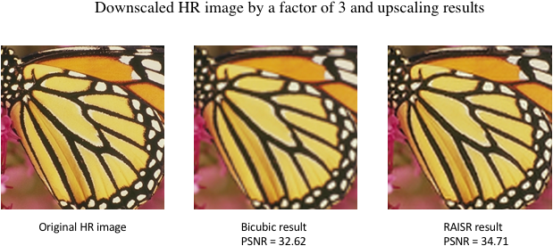

# Jalali-Lab Implementation of RAISR Algorithm

[RAISR](http://ieeexplore.ieee.org/stamp/stamp.jsp?arnumber=7744595) (Rapid and Accurate Image Super Resolution) is an image processing algorithm published by Google Research in 2016. With sufficient training data, consisting of low and high resolution image pairs, RAISR algorithm tries to learn a set of filters which can be applied to an input image that is not in the training set, to produce a higher resolution version of it. The source code released here is the Jalali-Lab implementation of the RAISR algorithm in Python 3.x written by Sifeng He. The implementation presented here achieved performance results that are comparable to that presented in Google's research paper (with less than &#177; 0.1 dB in PSNR). 
Just-in-time (JIT) compilation employing JIT numba is used to speed up the Python code. A very parallelized Python code employing multi-processing capabilities is used to speed up the testing process. The code has been tested on **GNU/Linux** and **Mac OS X 10.13.2** platforms. 

## Dependencies
All the dependent Python modules needed for the using our RAISR implementation can be installed using pip package manager and are the following:

*  NumPy
*  Numba
*  Python Imaging Library (PIL)
*  scipy
*  os
*  pickle
*  skimage

## Training
All the training images are to be stored in the **trainingData** directory, before executing the **Train.py** script. In the training script, modify the upscaling factor, R, appropriately. The training outputs three files, **filter**, **Qfactor_str**, and **Qfactor_coh**, which are needed in the testing phase. The training data used in this implementation is the **BSD 200** ([Martin et al. ICCV 2001](https://www.eecs.berkeley.edu/Research/Projects/CS/vision/bsds/)). A pre-trained filter with upscaling factors x2, x3, and x4 are available for testing in the **Filter** directory.

## Testing
All the test images are to be stored in the **testData** directory, before executing the **Test.py** script. In the test script, change the upscaling factor, R, and filters. The result image will be saved in **results** fold. The test data used for the development of the algorithm were **Set 5** ([Bevilacqua et al. BMVC 2012](http://people.rennes.inria.fr/Aline.Roumy/results/SR_BMVC12.html)) and **Set 14** ([Zeyde et al. LNCS 2010](https://sites.google.com/site/romanzeyde/research-interests)). 

## Quantitative Comparison
Google's RAISR implementation was trained on 10000 advertising banner images. Our implementation of RAISR was trained on [BSD 200] (https://www.eecs.berkeley.edu/Research/Projects/CS/vision/bsds/) (200 images) and on 500 images from [COCO](http://mscoco.org/) dataset. The training time for our implementation on a 3.4 GHz 6-core Xeon desktop computer is about 20 minutes for BSD 200 dataset and an hour for the 500 images from COCO dataset. The average test time for one single image in test dataset ([Set 5](http://people.rennes.inria.fr/Aline.Roumy/results/SR_BMVC12.html) and [Set 14](https://sites.google.com/site/romanzeyde/research-interests)) is less than 1 second.

| Upscale Factor | Google RAISR  | Our implementation trained   on BSD 200 images | Our implementation trained   on COCO (500 images) |
|:-------------: |:---------------:| :-------------:| :-------------:|
| 2x      | 35.913 |   35.855|     35.878 |
| 3x      | 32.061 |   31.981|     32.019 |
| 4x      | 29.689 |   29.717|     29.801 |
##### Table 1. Comparison of Results on [Set 5](http://people.rennes.inria.fr/Aline.Roumy/results/SR_BMVC12.html) Images

 

| Upscale Factor | Google RAISR  | Our implementation trained   on BSD 200 images | Our implementation trained   on COCO (500 images) |
|:-------------: |:---------------:| :-------------:| :-------------:|
| 2x      | 31.980 |   31.790|     31.816 |
| 3x      | 28.764 |   31.714|     28.729 |
| 4x      | 26.912 |   26.901|     26.935 |
##### Table 2. Comparison of Results Results on [Set 14](https://sites.google.com/site/romanzeyde/research-interests) Images

## Sample Result
A high resolution image after downscaling it by 3 was used as the input low resolution image, to both bicubic interpolation and our implementation of RAISR. The results for this testcase comparing the original high resolution image, bicubic interpolation output image and output of our implementation of RAISR are shown below:

